# StreamWeave

> **Pre-Alpha Software**: StreamWeave is under heavy active development and not yet ready for production use. APIs, data models, and configuration formats may change without notice.

<div align="center">
    
    <p style="font-size:0.7rem;opacity:0.75;margin:1rem 0 1rem 0;"><em>Scientific data harvesting, simplified.</em></p>
</div>

<div align="center">

[](https://github.com/datasophos/streamweave/actions/workflows/backend.yml)
[](https://github.com/datasophos/streamweave/actions/workflows/frontend.yml)
[](https://codecov.io/gh/datasophos/streamweave)
[](https://opensource.org/licenses/MIT)
<br/>
[](https://datasophos.github.io/streamweave)
[](https://pypi.org/project/streamweave/)
[](https://pypi.org/project/streamweave/)

</div>

StreamWeave simplifies the process of moving experimental instrument data from a wide network of tools into one or more centralized target locations.
It provides an easy framework to periodically pull data from CIFS/SMB shares on scientific instruments via service accounts and deliver it to configured storage destinations (POSIX, S3, NFS, CIFS), with persistent file identifiers, full transfer audit trails, and a configurable hook system for integration with external APIs.

## Key Features

- **Automated harvesting** — Prefect-orchestrated workflows discover and transfer new files on a cron schedule
- **Persistent identifiers** — Every file receives a unique ARK identifier for long-term tracking
- **Transfer auditing** — Full audit trail with checksums, timestamps, and byte counts for every file transfer
- **Hook system** — Configurable pre-transfer (file filtering, redirect) and post-transfer (metadata enrichment) hooks
- **Groups & Projects** — Organize instruments and users into groups; scope data access via projects
- **User-scoped access** — Admins manage everything; regular users see only their assigned instruments
- **Pluggable transfers** — rclone by default, with a pluggable adapter interface for Globus, rsync, etc.
- **React frontend** — Full admin UI built with React + Vite + TanStack Query + Tailwind CSS

## Architecture

| Component | Technology |
|---|---|
| API Backend | FastAPI + SQLAlchemy 2.0 + Alembic |
| Auth | fastapi-users (local accounts; OAuth2/OIDC planned) |
| Database | PostgreSQL (SQLite for dev/small deployments) |
| Orchestration | Prefect (self-hosted server + workers) |
| Default Transfer | rclone (pluggable: Globus, rsync) |
| Frontend | React 18 + Vite + TanStack Query v5 + Tailwind CSS |
| Reverse Proxy | Caddy |
| Identifiers | ARK (configurable DOI/Handle) |
| Credential Storage | Fernet encryption at rest |
| Deployment | Docker Compose |

```mermaid
flowchart TD
    Instruments["🔬 Instruments<br/>(CIFS/SMB shares)"]
    Prefect["⚙️ Prefect<br/>Orchestrator"]
    API["🚀 FastAPI<br/>Backend"]
    DB[("🗄️ PostgreSQL")]
    rclone["📦 rclone<br/>(transfer engine)"]
    Storage["🗃️ Storage<br/>(POSIX · S3 · NFS · CIFS)"]
    Frontend["🖥️ React<br/>Frontend"]
    Caddy["🔀 Caddy<br/>Reverse Proxy"]
    Users["👤 Users /<br/>Admin"]

    Users -->|browser| Caddy
    Caddy -->|"/api/*"| API
    Caddy -->|"/*"| Frontend
    API <-->|ORM| DB
    Prefect -->|trigger harvest| API
    Prefect -->|invoke| rclone
    rclone -->|read| Instruments
    rclone -->|write| Storage
    API -->|schedule & monitor| Prefect
```



## Quick Start

### Prerequisites

- Docker & Docker Compose
- Python 3.11+ and [uv](https://docs.astral.sh/uv/) (for local development)

### Run with Docker

```bash
cp .env.example .env
# Edit .env with your secrets (especially STREAMWEAVE_ENCRYPTION_KEY and SECRET_KEY)
docker compose up
```

The API will be available at `http://localhost:8000` with Swagger docs at `http://localhost:8000/docs`.
The frontend will be available at `http://localhost:80`.

### Dev Deployment (hot reload)

For more details, see the [development deployment](https://datasophos.github.io/streamweave/getting-started/development/) guide, but briefly:

Add `127.0.0.1 streamweave.local` to your `/etc/hosts` and run `scripts/setup-dev-certs.sh` (make sure [mkcert](https://github.com/FiloSottile/mkcert#installation))
is installed). Then run:

```bash
docker compose -f docker-compose.yml -f docker-compose.dev.yml up --build
```

A default admin user (`admin@example.com` / `adminpassword`) and regular user accounts are created automatically on first boot.

Override with `ADMIN_EMAIL` and `ADMIN_PASSWORD` in your `.env`.

- Frontend dev server: `https://streamweave.local`
- API: `https://streamweave.local/api`

### Run Tests

```bash
# backend
./scripts/test_backend.sh

# frontend
./scripts/test_frontend.sh
```

## API Endpoints

All resource endpoints require authentication. Admin role required for management operations.

| Endpoint | Description |
|---|---|
| `POST /auth/register` | Register a new user |
| `POST /auth/jwt/login` | Get JWT access token |
| `/api/instruments` | CRUD for instruments + instrument requests |
| `/api/storage-locations` | CRUD for storage destinations |
| `/api/service-accounts` | CRUD for CIFS service accounts |
| `/api/schedules` | CRUD for harvest schedules |
| `/api/hooks` | CRUD for hook configurations |
| `/api/files` | Browse harvested files |
| `/api/transfers` | Transfer history and status |
| `/api/groups` | CRUD for groups + member management |
| `/api/projects` | CRUD for projects + member management |
| `/api/audit` | Audit log |
| `/api/notifications` | User notifications |
| `/api/admin/users` | Admin user management |
| `/health` | Health check |

Full interactive API docs are available at `/docs` (Swagger UI) or `/redoc` when the app is running.

## Documentation

Full documentation is available at [datasophos.github.io/streamweave](https://datasophos.github.io/streamweave), including:

- [Getting Started](https://datasophos.github.io/streamweave/getting-started/)
- [Architecture overview](https://datasophos.github.io/streamweave/architecture/)
- [API reference](https://datasophos.github.io/streamweave/api/)

To build and serve the docs locally:

```bash
scripts/build_docs.sh serve
```

## License

MIT
