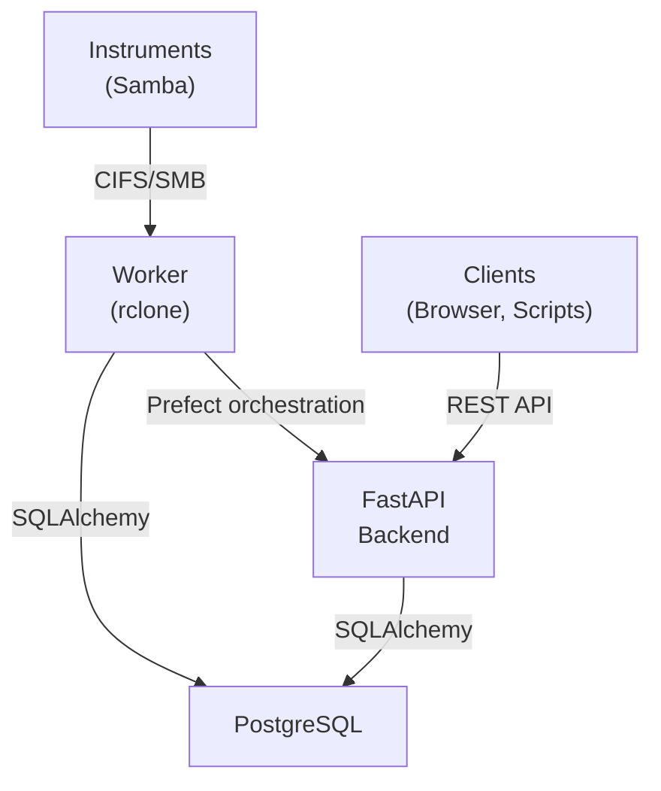

# Architecture

## System Overview

StreamWeave is a data harvesting pipeline for scientific instruments. It connects to instruments over CIFS/SMB, discovers new files, transfers them to managed storage, and maintains a full audit trail.

## Data Flow

### Harvest Pipeline

1. **Schedule triggers** — Prefect cron schedule fires (or manual trigger via API)
2. **Discovery** — Worker connects to instrument via rclone, runs `rclone lsjson --recursive` to list all files
3. **Deduplication** — Discovered files are compared against existing `FileRecord` entries by `source_path`
4. **Pre-transfer hooks** — For each new file, pre-transfer hooks run (e.g., file filter to skip `*.tmp`)
5. **Transfer** — rclone copies the file from the instrument to the destination storage
6. **Checksum verification** — xxhash computed on the transferred file and stored
7. **Post-transfer hooks** — Metadata enrichment and other post-processing
8. **Record creation** — `FileRecord` and `FileTransfer` entries written to the database

### Identifier Minting

Every file receives a persistent ARK identifier (`ark:/99999/fk4...`) at discovery time, before transfer. This ensures files are trackable even if transfers fail or are retried.

## Key Components

### Transfer Adapters

The transfer layer uses a pluggable adapter pattern:

- **`TransferAdapter`** — Abstract base class defining `discover()`, `transfer_file()`, and `checksum()` methods
- **`RcloneAdapter`** — Default implementation using rclone CLI for CIFS/SMB transfers
- **`factory.py`** — Creates the right adapter based on instrument configuration

rclone is invoked via `asyncio.create_subprocess_exec` with connection details passed as CLI flags (no config files), allowing concurrent harvests from different instruments.

### Hook System

Hooks are configurable actions that run during the harvest pipeline:

- **Pre-transfer hooks** — Run before each file transfer. Can `skip` (exclude the file), `redirect` (change destination), or `proceed`.
- **Post-transfer hooks** — Run after successful transfer. Can add metadata to the file record.

Built-in hooks:

| Hook | Trigger | Description |
|---|---|---|
| `file_filter` | pre_transfer | Skip files matching glob patterns (`*.tmp`, `*.lock`) |
| `metadata_enrichment` | post_transfer | Extract metadata from file paths via regex named groups |

Hooks are stored as `HookConfig` database records and can be assigned per-instrument with priority ordering.

### Prefect Integration

StreamWeave uses Prefect 3.x for workflow orchestration:

- **Flow**: `harvest_instrument_flow` — Top-level orchestration for a single instrument
- **Tasks**: `discover_files_task`, `transfer_single_file_task` — Individual units of work with retry support
- **Deployments**: Created via the API when a harvest schedule is configured
- **Work pool**: `streamweave-worker-pool` — Process-based worker pool

The `PrefectClientService` wraps the Prefect Python client for deployment CRUD and manual trigger operations.

### Access Control

- **Admin users** — Full access to all instruments, files, and management operations
- **Regular users** — Can only view their own files and transfers. Instrument-level access (via `UserInstrumentAccess`) determines which instruments a user can harvest from, but does not grant visibility into other users' data on the same instrument
- Non-accessible resources return 404 (not 403) to avoid leaking existence information

## Database Models

| Model | Description |
|---|---|
| `Instrument` | Scientific instrument with CIFS connection details |
| `ServiceAccount` | Encrypted credentials for instrument access |
| `StorageLocation` | Destination for transferred files (POSIX, S3, etc.) |
| `HarvestSchedule` | Cron schedule linking an instrument to a storage location |
| `HookConfig` | Configurable hook with trigger, implementation, and priority |
| `FileRecord` | Discovered file with persistent ARK identifier and metadata |
| `FileTransfer` | Audit record for each file transfer attempt |
| `User` | Application user (via fastapi-users) |
| `UserInstrumentAccess` | Junction table for user-instrument permissions |
