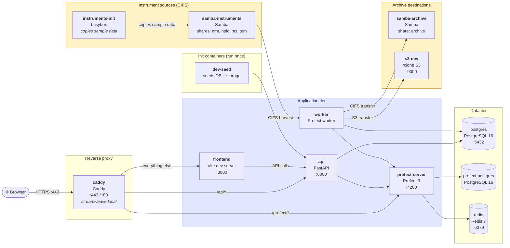

# Local Development

The dev stack runs the full StreamWeave service suite in Docker with hot reload, a local HTTPS hostname, pre-seeded test data, and Mailpit for email testing.

## Prerequisites

- [Docker Desktop](https://www.docker.com/products/docker-desktop/) (or Docker Engine + Compose plugin)
- `uv` — Python package manager ([install](https://docs.astral.sh/uv/))
- `mkcert` — local TLS certificate tool ([install](https://github.com/FiloSottile/mkcert#installation))

## One-Time Host Setup

### 1. Add the dev hostname to `/etc/hosts`

The dev stack is served at `https://streamweave.local`. Because `.local` mDNS only resolves real LAN devices (not loopback), you need a manual hosts entry:

=== "macOS / Linux"

    ```bash
    # check to see if there's already a line for streamweave in the
    # hosts file, and add one if not
    grep -qF '127.0.0.1 streamweave.local' /etc/hosts || echo '127.0.0.1 streamweave.local' | sudo tee -a /etc/hosts
    ```

    !!! warning "macOS: add an IPv6 entry too"
        On macOS, `.local` domains are handled by mDNS (Bonjour). Without an
        IPv6 entry, macOS issues a parallel AAAA mDNS query that times out
        after ~5 seconds on every first connection, making the app feel slow.
        Add this line to avoid it:

        ```bash
        # add ipv6 line to /etc/hosts if not already present
        grep -qF '::1 streamweave.local' /etc/hosts || echo '::1 streamweave.local' | sudo tee -a /etc/hosts
        # flush DNS cache and restart the resolver
        sudo dscacheutil -flushcache && sudo killall -HUP mDNSResponder
        ```

=== "Windows (run as Administrator)"

    ```powershell
    # check to see if there's already a line for streamweave in the 
    # hosts file, and add one if not
    if (-not (Select-String -Path "$env:SystemRoot\System32\drivers\etc\hosts" -Pattern '127\.0\.0\.1 streamweave\.local' -Quiet)) { Add-Content -Path "$env:SystemRoot\System32\drivers\etc\hosts" -Value "127.0.0.1 streamweave.local" }
    ```

### 2. Generate a local TLS certificate with mkcert

[mkcert](https://github.com/FiloSottile/mkcert) creates a locally-trusted dev CA and signs a certificate for `streamweave.local`. It installs the CA into your OS and browser trust stores automatically, so no manual certificate import is needed.

=== "macOS / Linux"

    Install mkcert, then run the helper script:

    ```bash
    # macOS
    brew install mkcert

    # Linux — see https://github.com/FiloSottile/mkcert#linux for your distro
    ```

    ```bash
    bash scripts/setup-dev-certs.sh
    ```

    The script runs `mkcert -install` (trusts the CA), writes
    `caddy/certs/streamweave.local.crt` / `.key` for Caddy to use, and
    copies the mkcert root CA to `caddy/certs/rootCA.pem` for use by
    Python httpx clients.

=== "Windows (run as Administrator)"

    Install mkcert via Chocolatey or Scoop, then run the commands manually:

    ```powershell
    choco install mkcert   # or: scoop install mkcert
    ```

    ```powershell
    mkcert -install
    New-Item -ItemType Directory -Force -Path caddy\certs | Out-Null
    mkcert -cert-file caddy\certs\streamweave.local.crt `
           -key-file  caddy\certs\streamweave.local.key `
           streamweave.local
    Copy-Item "$(mkcert -CAROOT)\rootCA.pem" caddy\certs\rootCA.pem
    ```

Restart your browser once after the first `mkcert -install`.

## Starting the Dev Stack

```bash
docker compose -f docker-compose.yml -f docker-compose.dev.yml up
```

On first boot, the `dev-seed` container automatically seeds the database with sample instruments, storage locations, schedules, and hooks. Re-running is safe — existing records are skipped.

## Services

| Service | URL | Description |
|---|---|---|
| **StreamWeave UI** | `https://streamweave.local` | React frontend (Vite hot reload via Caddy) |
| **Prefect UI** | `https://streamweave.local/prefect/` | Orchestration dashboard (admin-only) |
| **Mailpit** | `https://streamweave.local/mail/` | SMTP catch-all — inspect all outgoing emails |
| **S3-dev** | `https://streamweave.local/s3/` | S3-compatible storage (access key: `devkey`, secret: `devsecret`) |
| **API docs** | `https://streamweave.local/docs` | Swagger UI |
| **API ReDoc** | `https://streamweave.local/redoc` | ReDoc API reference |

The CIFS instrument simulators (NMR, HPLC, MS, TEM) are available internally on the Docker network for the worker to harvest from.

## Architecture



## Logging In

### Demo mode shortcuts

The dev stack runs with `VITE_DEMO_MODE=true`, which adds one-click login buttons on the login page for the admin account, and a few example user
accounts in different groups.

| Role | Email | Password |
|---|---|---|
| Admin | `admin@example.com` | `adminpassword` |
| Regular user | `chemist@example.com` | `devpass123!` |
| Regular user | `proteomics@example.com` | `devpass123!` |
| Regular user | `em-operator@example.com` | `devpass123!` |

You can override the default admin credentials with environment variables before starting:

```bash
export ADMIN_EMAIL=me@example.com
export ADMIN_PASSWORD=mypassword
docker compose -f docker-compose.yml -f docker-compose.dev.yml up
```

## TORTURE_MODE: Stress-Testing with Large Datasets

`TORTURE_MODE` pre-loads the database with a large, realistic dataset on startup. Use it when you need to stress-test pagination, UI performance, or query latency with hundreds of instruments and hundreds of thousands of files.

### Activation

Add `TORTURE_MODE=true` to your `.env` file (or to the backend service's `environment` block in `docker-compose.dev.yml`):

```bash
echo "TORTURE_MODE=true" >> .env
```

Then start (or restart) the backend. The seeder runs automatically during the FastAPI lifespan startup hook.

### What gets seeded

| Entity | Count (defaults) |
|--------|-----------------|
| Storage location | 1 — "TORTURE Archive" |
| Service accounts | 4 — one per instrument type |
| Instruments | 200 — 50 each of NMR, HPLC, MS, TEM |
| Harvest schedules | 200 — one per instrument |
| File records | ~200 000 — ~1 000 per instrument |

All instruments are named `TORTURE-{TYPE}-{NNN}` (e.g. `TORTURE-NMR-001`). File paths follow realistic directory trees for each instrument type:

| Type | Path pattern |
|------|-------------|
| NMR (Bruker) | `/{year}/{mm}/{dd}/{expno:04d}/{fname}` |
| HPLC (Waters) | `/{year}/{mm}/{set_name}/{fname}` |
| MS (Thermo) | `/{year}/batch_{batch:04d}/{fname}` |
| TEM (FEI) | `/{year}/{n:04d}_{session_date}/{fname}` |

### Idempotency

The seeder is safe to run repeatedly. If any instrument whose name starts with `TORTURE-` already exists, the seeder prints a skip message and returns without inserting anything.

### Removing torture data

The seeder has no built-in teardown. To remove torture data, either drop and recreate the database, or run a targeted delete:

```bash
# Connect to the running backend container and open a Python shell
docker compose exec backend uv run python - <<'EOF'
import asyncio
from sqlalchemy import delete, select
from app.database import async_session_factory
from app.models.instrument import Instrument

async def main():
    async with async_session_factory() as session:
        result = await session.execute(
            select(Instrument.id).where(Instrument.name.like("TORTURE-%"))
        )
        ids = result.scalars().all()
        print(f"Deleting {len(ids)} TORTURE instruments…")
        await session.execute(
            delete(Instrument).where(Instrument.name.like("TORTURE-%"))
        )
        await session.commit()
        print("Done.")

asyncio.run(main())
EOF
```

!!! warning "File records are not cascade-deleted"
    The `FileRecord` rows reference instruments via a foreign key but have no `ON DELETE CASCADE`. If you need a clean slate, it is simpler to drop and recreate the dev database than to manually delete in dependency order.

## Hot Reload

- **Frontend**: Vite serves `frontend/src/` directly; changes reload the browser instantly.
- **Backend**: `uvicorn --reload` watches `backend/app/`; changes restart the API server.

## Running Tests

Both the frotend and backend test suites use in-process mocks and do not require the Docker stack to be running. These scripts will also report
coverage. It is expected that test coverage will always be at 100%.

Backend:

```bash
scripts/test_backend.sh
```

Frontend:

```bash
scripts/test_frontend.sh
```

## Linting

The following scripts will check the codebase for code style issues and report any errors. Running these prior to commits will help prevent CI issues:

```bash
scripts/lint_backend.sh
scripts/lint_frontend.sh
```

## Pre-commit config

StreamWeave uses [prek](https://github.com/j178/prek) (a Rust-based pre-commit runner) with a standard `.pre-commit-config.yaml` file. The hooks run automatically on `git commit`, or you can invoke them manually:

```bash
# Run all hooks against staged files
prek run

# Run a specific hook
prek run ruff
prek run eslint

# Install the git hook (one-time, per clone)
prek install
```

The configured hooks are:

| Hook | Scope | What it does |
|------|-------|--------------|
| `ruff` | `backend/` | Lint Python with auto-fix |
| `ruff-format` | `backend/` | Format Python |
| `ty` | `backend/` | Type-check Python with `uv run ty check` |
| `prettier` | `frontend/src/` | Format TypeScript/TSX |
| `eslint` | `frontend/src/` | Lint TypeScript/TSX |
| `tsc` | `frontend/` | Type-check TypeScript (`--noEmit`) |

!!! tip "Install prek"
    ```bash
    brew install jdx/tap/prek
    ```
    Then run `prek install` once per clone to register the git hook.
